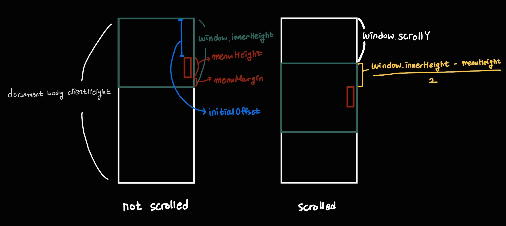

# React scroll event

## 💻Stack

- react
- styled-components

## Overview

When you surf the Internet, you can easily find some website that react to mouse scroll events. In this project, I practiced react by creating webpage that changes in response to user scroll.

Following are features this webpage has.

1. [A Scroll-to-Top button](#scroll-to-top-button)
2. [A quick menu which follows the user](#quick-menu)
3. [A navigation bar that knows which content is currently displaying](#navigation-bar)

## ✨Scroll-to-Top Button

<div align="center">
  
</div>

- I added an onClick event handler to the button component, and used a **window.scrollTo** function to scroll to the top of the page when clicking this button. In the scrollTo funtion, we can use a **behavior parameter** to specify whether the scrolling animate smoothly or not.

```js
// ScrollToTop.js
const ScrollToTop = () => {
  return (
    <Container onClick={() => window.scrollTo({ top: 0, behavior: 'smooth' })}>
      <FontAwesomeIcon icon={faArrowCircleUp} />
    </Container>
  );
};
```

- At first (when window.scrollY is 0), I hid the Scroll-to-Top button from the users. And if a user scrolls and window.scrollY value exceed 400px, I made the button come into sight.

```js
// ScrollToTop.js
const Container = styled.button`
  ...
  transition: transform 1s ease-in-out, opacity 1s ease-in-out;
  ${(props) =>
    props.visible
      ? css`
          opacity: 0.7;
          transform: translateY(0);
        `
      : css`
          opacity: 0;
          transform: translateY(80px);
        `}
`;

const ScrollToTop = () => {
  const [visible, setVisible] = useState(false);
  useEffect(() => {
    const toggleVisibility = () => {
      if (window.scrollY > 400) {
        setVisible(true);
      } else {
        setVisible(false);
      }
    };

    window.addEventListener('scroll', toggleVisibility);

    return () => window.removeEventListener('scroll', toggleVisibility);
  }, []);

  return (
    <Container
      onClick={() => window.scrollTo({ top: 0, behavior: 'smooth' })}
      visible={visible}
    >
      <FontAwesomeIcon icon={faArrowCircleUp} />
    </Container>
  );
};
```

## ✨Quick Menu


- When the page is loaded or reloaded, the quick menu is located at the bottom-right corner of the browser. If a user scrolls to some point (where a value of window.scrollY > window.innerHeight / 2), the quick menu is located at the middle-right of the brower.

```js
// QuickMenu.js
const menuHeight = 360;
const menuMargin = 48;

...

const QuickMenu = () => {
  const windowHeight = window.innerHeight;
  const initialOffset = windowHeight - (menuHeight + menuMargin);
  const [topOffset, setTopOffset] = useState(initialOffset);

  useEffect(() => {
    const moveQuickMenu = () => {
      const scroll = window.scrollY;
      let offset = scroll + (windowHeight - menuHeight) / 2;

      if (scroll < windowHeight / 2) {
        offset = initialOffset;
      }

      setTopOffset(offset);
    };

    window.addEventListener('scroll', moveQuickMenu);

    return () => window.removeEventListener('scroll', moveQuickMenu);
  }, [initialOffset, windowHeight]);

  ...
};
```


White Box is for the document | Green Box is for the winow | Red Box is for the quick menu

## ✨Navigation Bar


Navigation changes as a user scrolls.


Page changes as a user click on a navigation menu.

- When a user scrolls, the navigation bar is aware of which page is currently displayed and highlight a menu representing that page with a page's background color. Also, if a user click a menu, window scrolls to show a corresponding page.

- First, I passed color array and pageRefs to Header and Pages components from the App component.

```js
// App.js
const backgroundColors = ['#c49797', '#b6c497', '#97c4c1', '#aa97c4'];

const App = () => {
  const firstPage = useRef();
  const secondPage = useRef();
  const thirdPage = useRef();
  const fourthPage = useRef();

  const pageRefs = [firstPage, secondPage, thirdPage, fourthPage];

  return (
    <>
      <Header
        headerHeight={headerHeight}
        backgroundColors={backgroundColors}
        pageRefs={pageRefs}
      />
      <Pages
        headerHeight={headerHeight}
        backgroundColors={backgroundColors}
        pageRefs={pageRefs}
      />
    </>
  );
};
```

- Next, in the Header.js and Pages.js I used the refs to connect pages with menus.

```js
// Header.js
...
const Menu = styled.button`
  ...
  &.selected {
    font-size: 1.05em;
    color: ${(props) => props.color};
  }
`;

const Header = ({ headerHeight, backgroundColors, pageRefs }) => {
  ...
  const scrollToPage = (index) => {
    let topOffset = pageRefs[index].current.offsetTop;
    window.scrollTo({ top: topOffset, behavior: 'smooth' });
  };

  return (
    <Container headerHeight={headerHeight}>
      ...
      <Navigation>
        <ul>
          {navItem.map((item, index) => {
            const className = index === menuIndex ? 'selected' : '';

            return (
              <div key={index}>
                <Menu
                  onClick={() => scrollToPage(index)}
                  className={className}
                  color={backgroundColors[index]}
                >
                  {item}
                </Menu>
              </div>
            );
          })}
        </ul>
      </Navigation>
    </Container>
  );
```

```js
// Pages.js
const Pages = ({ headerHeight, backgroundColors, pageRefs }) => {
  return (
    <Container headerHeight={headerHeight}>
      <RecommendedItems ref={pageRefs[0]} backgroundColor={backgroundColors[0]}>
        Recommended Items
      </RecommendedItems>
      <BestItems ref={pageRefs[1]} backgroundColor={backgroundColors[1]}>
        Best Items
      </BestItems>
      <About ref={pageRefs[2]} backgroundColor={backgroundColors[2]}>
        About
      </About>
      <Contact ref={pageRefs[3]} backgroundColor={backgroundColors[3]}>
        Contact
      </Contact>
    </Container>
  );
};
```
